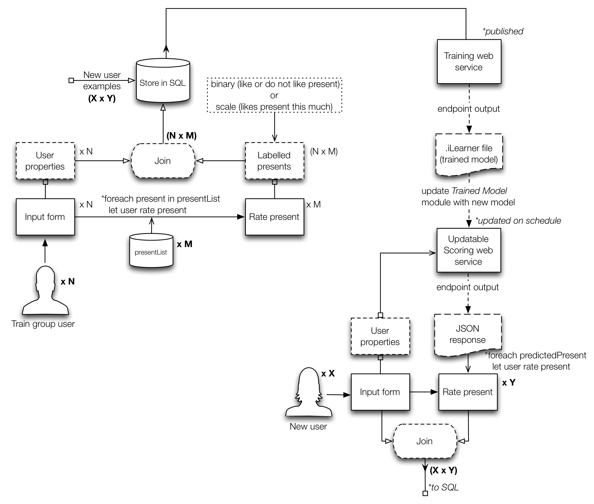
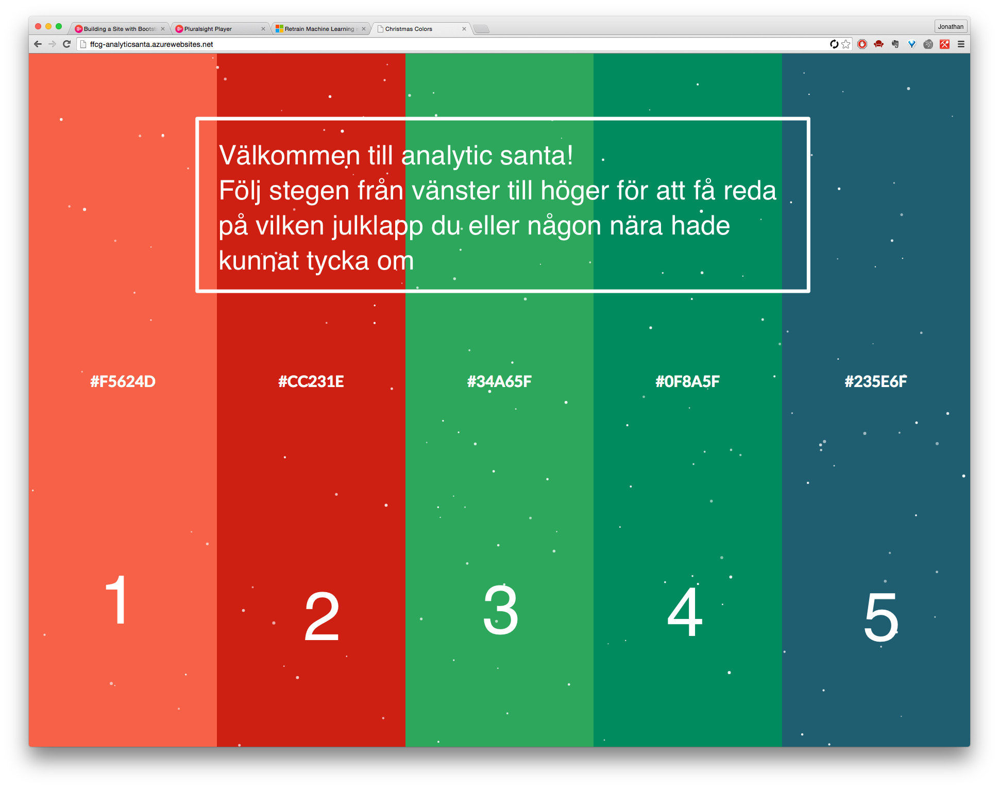

# Analytic santa - anteckningar

Webpage link :: [ffcg-analyticsanta.azurewebsites.net](http://ffcg-analyticsanta.azurewebsites.net/)
 GitHub repo :: [JAkerblom/analytic-santa.git](https://github.com/JAkerblom/analytic-santa)

## Plan

### Moment att adressera
* Efterforskning/insamling av data 
	* Klappdata + Extern data + Intern data
* Efterforskning/implementering av ML-modell i Azure 
	* ==Multiclass== vs ~~One-vs-all vs Neural net~~ vs ==Matchbox recommender== 
* Efterforskning/implementering av feedback loop [-->](#feedbackloop)
	* ~~Reinforcement learning vs Online learning~~ vs ==Programmatic retraining== 
* Hemsida 
	* Front-end 
		1. Formulär för inmatning av persondata
		* Vy för klappförslag med feedback-inmatning
		* Dynamisk och reaktiv inmatning samt resultatvisning  `CSS3 och AngularJS`
	* Back-end
		1. Lagring av inmatning och resultat i SQL vs ~~NoSQL vs Blob storage~~  `jQuery->Ajax->PHP?? Bättre tips? Osäker på Node.JS och MongoDB`
		* API-kommunikation mot deployed Azure ML web service  `jQuery->Ajax->PHP , har jag använt i amd-hemsidan.`
		* Programatic retraining (se feedback loop)  `C# script??`
		* **Bootstrapped och helhet enligt MVC**   `Azure->ASP.NET MVC4 kommer kräva upplärning.`
* Social netw. marketing 
	* Länk med bra bild att lägga upp på facebook och yammer.  `Kan någon kan förse mig med en kul bild som är forefront:ig och julig?`

### Aktivitetsplan

Moment					| Beskrivning | Tidsåtgång
-------------------	| ----------- | ----------
Data: Klappar			| <input type="checkbox"> Kartläggning av klappar | 5h
						| <input type="checkbox"> Insamling av bilder från klappar | 2h 
						| <input type="checkbox"> Insamling av beskrivning/titel/pris/grupp (lite datadrivet eftersom det kan ge prediktorer) | 7h
Data: Extern			| <input type="checkbox"> Ta fram dataset från lämplig datakälla (SCB?) | 1h (+efterforskning)
						| <input type="checkbox"> Strukturera dataset och gör om eventuella features till lämplig datatyp. | 4h (+trials and errors)
						| <input type="checkbox"> Deploya dataset som blob storage. | 1h 
Data: Intern			| <input type="checkbox"> Kom på vettiga/roliga frågor | 4h
						| <input type="checkbox"> Bestäm frågornas datatyper | 1h 
						| <input type="checkbox"> Bestäm formulärelement | 1h
Azure					| <input type="checkbox"> Bestämma approach | - (1d research)
						| <input type="checkbox"> Bygga testdataset för test av genomförbarhet. Speciellt fokus på svarsvariabeln. | 4h
						| <input type="checkbox"> Bygg modell | 5h 
						| <input type="checkbox"> Bygg struktur för input och koppla i Azure (beror på backend approach). | 3h
						| <input type="checkbox"> Deploy web service och hooka på i hemsidan. | 1h
Feedback loop			| <input type="checkbox"> Välj approach till feedback loop | - (1d research)
						| <input type="checkbox"> Implementera lösning | 2d
Webb: Front-end		| <input type="checkbox"> Välj tema | 5h
						| <input type="checkbox"> Bestäm vy-upplägg med syfte på varje vy | 6h 
						| <input type="checkbox"> Ta fram koncept på formulärelement | 5h
						| <input type="checkbox"> Ta fram koncept på vyerna | 1d
						| <input type="checkbox"> Implementera reaktiva element (AngularJS / jQuery) | 2d
						| <input type="checkbox"> Implementera HTML/CSS | 3d
Webb: Back-end		| <input type="checkbox"> Bestäm lagringsmetod för input-data (går mot retraining-biten) | 4h
						| <input type="checkbox"> Välj metod (php/Node.js) och implementera script för lagring av input-data. | 1d
						| <input type="checkbox"> Sätt ihop kommunikation mellan vyer. | 1d
						| <input type="checkbox"> Sätt upp kommunikation mot Azure | 4h
						| <input type="checkbox"> Implementera kodlösningen för automatisk programmatisk retraining genom hemsidan. | - 
						| *Förutsatt att jag lägger all min tid på det här är tidsåtgången ››››››››››*| **Total**   11d + 64h ≈ 19d   @ ca. 4-6dec

## Datan
### 1. Klappdata (artiklar)
Man hade exempelvis kunnat gå efter någon stor aktör som Amazon som [predikterar](http://www.madeformums.com/news-and-gossip/must-have-toys-for-christmas-from-the-biggest-sellers/30958.html) bra presenter. Eller så tar man något mer som är mer eller mindre tillgängligt i Sverige och är mer sannolikt en populär klapp pga interna trender. 

#### 1.i Aktiviteter
* <input type="checkbox"> Kartläggning av klappar
* <input type="checkbox"> Insamling av bilder från klappar
* <input type="checkbox"> Insamling av beskrivning/titel/pris/grupp (lite datadrivet eftersom det kan ge förklarande variabler)
 

### 2. Extern data
Det här rör demografiska data som kan ge ytterligare förklarande variabler. Exempelvis från postnummer. Kan det ge persona också så är det ju superbra. Vet att hitta.se har en livsstils app där de genom gatan kan få reda på medelinkomst, skuldsättning och vad folk på denna gata gillar i livet (vin, kultur, aktiehandel). 

#### 2.i Aktiviteter
* <input type="checkbox"> Ta fram dataset från lämplig datakälla (SCB?)
* <input type="checkbox"> Strukturera dataset och gör om eventuella features till lämplig datatyp. Inkomst -> Inkomstgrupp, till exempel.
* <input type="checkbox"> Deploya dataset som blob storage 

### 3. Intern data
Detta gäller främst insamling från anställda på forefront med målet att få med de grundläggande **förklarande variablerna** och **svarsvariabeln**. 

* **Svarsvariabelns** utformning beror på om man har reinforcement learning som utgångspunkt eller ren retraining av modellen. Det förstnämnda innebär en plus/minus-poäng till predikteringen. Det sistnämnda innebär att feedback-svaret är det som predikteras. I det fallet kan man t.ex. prediktera binärt ("var det en bra gissning tycker du?") eller ordinalt ("hur bra var den här gissningen på en skala från 1-5?"). Då handlar det om att gissa en skala och välja det alternativ som ger maximal siffra på skalan. 
* Hade varit kul också att göra lite roliga frågor oavsett om de är vettiga variabler i slutändan. Vissa kan ju visa sig ge entropi, tänk bayes. 

#### 3.i Aktiviteter

* <input type="checkbox"> Kom på vettiga och roliga frågor
* <input type="checkbox"> Bestäm frågornas datatyper
* <input type="checkbox"> Bestäm formulärelement

#### 3.ii Förslag på grundläggande data (formuläret)
Prediktor		| Värden        | Beteckning
-------------	| ------------- | -------------
Kön				| `{0, 1}[NOMINAL::BINARY]`	| `sexType`
Ålder			| `{0-100}[DISCRETE]`	| `age`
				| `{1,2,3,4,5n}[ORDINAL/?/INTERVAL]` | `ageGroup`
Relation		| `{Spouse, Child, Parent, Sibling}[NOMINAL]` Kan bli knepig, man skriver ju in data för sig själv. Vi kan väl inte prediktera utifrån en extern relation då. | `relation`
Postnummer 	| `{?:/xxx xx/}[NOMINAL]` | `zipCode`
Senast reseland | Svårimplementerad. Kika på binära preferenser istället | `lastTravelDestination`
Föredrar sol / vintersemester	| `{0, 1}[NOMINAL::BINARY]` | `prefersSuntrip`
Föredrar mjuka / hårda klappar | `{0, 1}[NOMINAL::BINARY]` | `prefersSoftPresents`
Vilken choklad i Paradisasken | `{X, 0, 1, 2, ...}[NOMINAL]` | `chocolatePref`
Tror på tomten | `{Y, N, ?}[NOMINAL::BINARY]`| `santaBelief`

### Notes
* Alla presenter som ska föreslås, det är ju också ett arbete att ta fram! Kolla årets julklappar någonstans? Göra en lista på vanliga butiker som folk köper klappar på eller kika på enstaka artiklar som varit populära på sistone. Har amazon sån data?
* Jag kan samla in all interna data från Forefront. Klurigt hur det kan gå till med feedback-loopen. Man kan tänka sig att alla matar in information om flera klappar, om inte alla! Det kunde vara t.ex. en sorts godkännande/bortkastande eller rangordning av klappar. Visar man många tänker jag att det förstnämnda är lättare. Visar man det sistnämnda så är det nog bättre med färre. Det förstnämnda innebär dock problem i hur du konstruerar responsvariabeln och val av ML approach.
* Om man skulle ge en del alternativ för folk som samlar in data, vad påverkar det att man inte ger alla alternativen? Vi kanske har 50 klappar på lager men vi vill bara att en person ska på sin höjd få tre förslag som den ska ta ställning till om den tycker det är vettiga förslag eller ej. Då kan man ju inte köra one-vs-all för personen har inte tagit ställning till alla andra alternativ när den bestämmer sig för just en. 

## Azure

### Aktiviteter

* <input type="checkbox"> Bestämma approach
* <input type="checkbox"> Bygga testdataset för test av genomförbarhet. Speciellt fokus på svarsvariabeln.
* <input type="checkbox"> Bygg modell
* <input type="checkbox"> Bygg struktur för input och koppla i Azure (beror på backend approach).
* <input type="checkbox"> Deploy web service och hooka på i hemsidan.

### Alternativ
Främst i Azure så har jag kikat på att använda mig av antingen:

* Multiclass classifier
* One-vs-all med two-class classifier
* Neural net
* Hybrid matchbox recommender

#### 1. Multiclass classifier

* Multiclass classification med
	* Multiclass decision forest
	* Multiclass logistic regression
	* Multiclass decision jungle, också nytt för mig här.

#### 2. One-vs-all w. two-class classifier

* Two-class decision forest
* Two-class boosted decision tree
* Two-class Bayes point machine
* Two-class logistic regression	
* Two-class averaged perceptron
* Eventuellt också Two-class decision jungle, inte prövat tidigare.

#### 3. Neural net
Osäker på hur det hade gått till med hela retraining-biten. Jag är van vid att neurala nätverk tar lång tid att träna, så där måste man nog fokusera på reinforcement learning vilket är lite utanför min kunskapsdomän.

#### 4. Hybrid matchbox recommender
Att lära modell utifrån rating

Använder man Azure Matchbox recommender så ska man veta vilka två typer det finns att utgå ifrån när det kommer till recommenders:

* Content-based approach
	* makes use of features for both users and items. Users may be described by properties such as age and gender, and items may be described by properties such as author and manufacturer. Typical examples of content-based recommendation systems can be found on social matchmaking sites.
* Collaborative filtering	
	* uses only identifiers of the users and the items and obtains implicit information about these entities from a (sparse) matrix of ratings given by the users to the items. We can learn about a user from the items they have rated and from other users who have rated the same items.
* The Matchbox recommender combines collaborative filtering with a content-based approach. It is therefore considered a hybrid recommender. When a user is relatively new to the system, predictions are improved by making use of the feature information about the user, thus addressing the well-known "cold-start" problem. However, once there are a sufficient number of ratings from a particular user, it is possible to make fully personalized predictions for them based on their specific ratings rather than on their features alone. Hence, there is a smooth transition from content-based recommendations to recommendations based on collaborative filtering. Even if user or item features are not available, Matchbox will still work in its collaborative filtering mode.
* En recommender kräver ett smart upplägg på inparametrarna. Se [den här](https://msdn.microsoft.com/library/azure/55544522-9a10-44bd-884f-9a91a9cec2cd?f=255&MSPPError=-2147217396#ItemRecommendationOptions) beskrivningen för mer info. 

## Feedback loop
Hittills har mestadels av alla google-länkar lett mig till reinforcement learning (RL). Eftersom det känns som ett annat sorts problem (mer robotar och likheter mot reglerteknik), så har jag satt stopp för just den här grenen. Det jag i annat fall är ute efter är en modell som återtränas, t.ex. vissa klockslag under dagen eller efter ett visst antal svarsinlägg, detta relaterar till programmatic retraining av ens modell. 

### Aktiviteter

* <input type="checkbox"> Välj approach till feedback loop
* <input type="checkbox"> Implementera lösning (ev. lite kodning jag inte är van vid)

### Relevanta begrepp
* RL (reinforcement learning).
* Online learning (tips på automatiserad inlärning)
* Programmatic retraining

### Programmatic retraining
Retraining har Azure [ett exempel](https://azure.microsoft.com/sv-se/documentation/articles/machine-learning-retrain-models-programmatically/) på hur man kan implementera för att *Retrain ML models programatically*. 

När man publishat sin modell (tränat) så kan man gå tillbaka till Training Experiment och lägga till en output module efter Train Model. Dock verkar det som att Microsofts dokumentation av Azure är för gammal för de har ändrat beteckningar på saker och ting. Kör Retraining web service, det borde ge samma resultat.

### Azure layout
Approachen kring retraining har jag satt till följande koncept.

### Notes
* ~~Problemet är att du på Azure till synes inte kan återträna modellen direkt. Och det verkar heller inte vara ett reinforcement learning problem, utan mer att varje ny person som svarar ger en till datarad.~~ Man kan återträna modellen direkt eller nästan direkt. 
	* Eventuellt hade man kunnat lägga upp två modeller där ena är igång när den andra tränas.
	* Det kan vara så att det går jättebra att träna modellen direkt efter ett svar kommit in och att det fungerar medan folk använder hemsidan. Man kan göra en avvägning när man ska byta ut endpointen -> Är den nya modellen bättre? Ja -> Är det någon som använder modellen nu? Ja -> Kolla igen om x minuter. 
* Feedback loopen hänger lite på vad man vill prediktera. T.ex. vill man prediktera om det är antingen en bra eller dålig julklapp att ge så är det binär feedback man vill få, alltså vad man själv tror om klappens hållbarhet framför granen. Vill man prediktera något i stil med likelyhood eller hur bra en present är så är det mer en skala man förhåller sig till och därav kanske frågar om vad man tror hållbarheten är på en skala mellan 1-10. 
* ~~Ska man kanske ska få en del alternativ och ge feedback på alla dessa? Det snabbar ju upp processen. Om det är genomförbart kanske man kan ge feedback på alla utifrån den persona som är aktuell. Dock kan det bli för tidsödande.~~ Alla som hjälper till med datainsamling måste ta ställning till alla presenter. När man kör lösningen kanske man bara får en del eller en present.
* ~~Ev. efterforskning på annan lösning. Där har t.ex. deployment av hemsida med R genom [OpenCPU](https://www.opencpu.org/apps.html) varit ett alternativ. Dock kan det ta ifrån den enkelheten som det innebär att arbeta med Azure i grunden. Men eftersom man kan arbeta med R mer direkt på hemsidan så kan man eventuellt implementera feedback-loopen lättare (aka mer som man vill).~~ Satsar på OpenCPU i senare projekt.
* Är publish web service samma sak som set up web service eller är det samma sak som publish to gallery? Det är det ingen som vet. Det är även så att när man trycker på 'set up web service' idag så kan du välja mellan att köra 'predictive experiment' eller 'retraining web service'. Det sistnämnda gör det som Microsofts dokumentation ber en om fast automatiskt. Väldigt väldigt otydligt och rentav irriterande.

## Hemsidan

### Front-end

#### Aktiviteter

* <input type="checkbox"> Välj tema
* <input type="checkbox"> Bestäm vy-upplägg med syfte på varje vy
* <input type="checkbox"> Ta fram koncept på formulärelement
* <input type="checkbox"> Ta fram koncept på vyerna
* <input type="checkbox"> Implementera reaktiva element (AngularJS / jQuery)
* <input type="checkbox"> Implementera HTML/CSS

#### Color palette

• F5624D • CC231E • 34A65F • 0F8A5F • 235E6F

#### Start view
Den här vyn baseras dels på att du vet vilket steg du befinner dig i, men även en horisontell accordion. Hade dock kunnat vara kul att göra om det här konceptet till din resultat-vy. Idén går ut på att klapparna gömmer sig bakom varje fält och när man trycker på en så åker fältet fram som accordion och klappen exponeras. Väl där får man rate:a klappen eller vad som nu bestäms. 

#### User properties view
Användaren kan börja med att mata in det som blir rena demografiska variabler. Nästa steg kan bli mer frågor som är roliga. 

#### Question view
Konceptuellt handlar det om att ha någon progress bar och lite fält med användarvänliga formulär-element. I det här fallet är det bara boxar för ja/nej. Lämpligt är att rita upp formulärstrukturen för sig själv. 

#### Results view
Den här vyn hänger mycket på hur man vill konstruera svarsvariabeln. Detta då det här steget behöver vara dels genomförbart och kul att göra, samt ge data som faktiskt hjälper en att prediktera presenter. 

### Back-end

#### Aktiviteter

* <input type="checkbox"> Bestäm lagringsmetod för input-data (går mot retraining-biten)
* <input type="checkbox"> Välj metod (php/Node.js) och implementera script för lagring av input-data.
* <input type="checkbox"> Sätt ihop kommunikation mellan vyer.
* <input type="checkbox"> Sätt upp kommunikation mot Azure
* <input type="checkbox"> Implementera kodlösningen för automatisk programmatisk retraining genom hemsidan.

## Länkar osv.
* [Slideshare:: Azure](http://www.slideshare.net/WorapotJakkhupan/308471-ch5-machine-learning-using-microsoft-azure/20)
* [Azure cheet sheat](https://azure.microsoft.com/sv-se/documentation/articles/machine-learning-algorithm-choice/)
* [Retrain programatically](https://azure.microsoft.com/sv-se/documentation/articles/machine-learning-retrain-models-programmatically/)
* Sökord:: Årets julklapp
* [Must-have toys | Amazon](http://www.madeformums.com/news-and-gossip/must-have-toys-for-christmas-from-the-biggest-sellers/30958.html)
* [Data types](https://en.wikivet.net/Data_types)
* [Score matchbox recommender](https://msdn.microsoft.com/library/azure/55544522-9a10-44bd-884f-9a91a9cec2cd?f=255&MSPPError=-2147217396#ItemRecommendationOptions)
* [Gåvor för p/f/m/k](https://www.thegreatgiftcompany.co.uk/occasions/special_occasions/christmas)