<!--<script src="https://ajax.googleapis.com/ajax/libs/jquery/1.8.3/jquery.min.js"></script>
<script>
	function hide() {
		//$(this).parent().css('display','none')
		$('#classifiers').css('display','none');
		console.log("hi there");
		console.log($('classifiers'));
	}
</script>-->
# Analytic santa - anteckningar

<span style="color:#464646;font-size:1.4em;">
Webpage link :: [ffcg-analyticsanta.azurewebsites.net](http://ffcg-analyticsanta.azurewebsites.net/)
<br>GitHub repo :: [JAkerblom/analytic-santa.git](https://github.com/JAkerblom/analytic-santa)
</span>

## Plan

### Moment att adressera
* Efterforskning/insamling av data 
	* Klappdata + Extern data + Intern data
* Efterforskning/implementering av ML-modell i Azure 
	* Regression models: ==Neural net== vs Decision forest/tree vs Bayesian
	* ~~Classifiers: Multiclass vs One-vs-all vs Neural net vs Matchbox recommender~~
* Efterforskning/implementering av feedback loop [-->](#feedbackloop)
	* ~~Reinforcement learning vs Online learning~~ vs ==Programmatic retraining== 
* Hemsida 
	* Front-end 
		1. Formulär för inmatning av persondata
		* Vy för klappförslag med feedback-inmatning
		* Dynamisk och reaktiv inmatning samt resultatvisning <br>`CSS3 och AngularJS`
	* Back-end
		1. Lagring av inmatning och resultat i SQL vs ~~NoSQL vs Blob storage~~ <br>`jQuery->Ajax->PHP?? Bättre tips? Osäker på Node.JS och MongoDB`
		* API-kommunikation mot deployed Azure ML web service <br>`jQuery->Ajax->PHP , har jag använt i amd-hemsidan.`
		* Programatic retraining (se feedback loop) <br>`C# script??`
		* **Bootstrapped och helhet enligt MVC** <br> `Azure->ASP.NET MVC4 kommer kräva upplärning.`
* Social netw. marketing 
	* Länk med bra bild att lägga upp på facebook och yammer.<br> `Kan någon kan förse mig med en kul bild som är forefront:ig och julig?`

### Aktivitetsplan

Moment					| Beskrivning | Tidsåtgång
-------------------	| ----------- | ----------
Data: Klappar			| <input type="checkbox" checked> Kartläggning av klappar | 5h
						| <input type="checkbox"> Insamling av bilder från klappar (kopplat till nästa och ev. relaterat till scraping)| 2h (3h) 
						| <input type="checkbox"> Insamling av beskrivning/titel/pris/grupp (lite datadrivet eftersom det kan ge prediktorer) | 7h
Data: Extern			| <input type="checkbox"> Ta fram dataset från lämplig datakälla (SCB?) | 1h (+efterforskning)
						| <input type="checkbox"> Strukturera dataset och gör om eventuella features till lämplig datatyp. | 4h (+trials and errors)
						| <input type="checkbox"> Deploya dataset som blob storage. | 1h 
Data: Intern			| <input type="checkbox" checked> Kom på vettiga/roliga frågor (kan behöva några till)| 4h
						| <input type="checkbox" checked> Bestäm frågornas datatyper | 1h 
						| <input type="checkbox"> Bestäm formulärelement | 1h
Azure					| <input type="checkbox" checked> Bestämma approach | - (1d research) -> Tog 3d med återvändsgränden
						| <input type="checkbox" checked> Bygga testdataset för test av genomförbarhet. Speciellt fokus på svarsvariabeln. | 4h
						| <input type="checkbox" checked> Bygg modell | 5h (totaltid är dagar)
						| <input type="checkbox"> Bygg struktur för input och koppla i Azure (beror på backend approach). | 3h
						| <input type="checkbox"> Deploy web service och hooka på i hemsidan. | 1h
Feedback loop			| <input type="checkbox" checked> Välj approach till feedback loop | - (1d research)
						| <input type="checkbox" checked> Implementera lösning | 2d (förhoppningsvis kortare)
Webb: Front-end		| <input type="checkbox"> Research kring hur man bygger en hemsida i .NET (krisar det struntar jag i .NET och fulkodar det som hemsidan till arbetsmarknadsdagarna) | 2d (värmt upp med två dagars research)
						| <input type="checkbox"> Välj tema | 5h
						| <input type="checkbox"> Bestäm vy-upplägg med syfte på varje vy | 6h 
						| <input type="checkbox"> Ta fram koncept på formulärelement | 5h
						| <input type="checkbox"> Ta fram koncept på vyerna | 1d
						| <input type="checkbox"> Implementera reaktiva element (AngularJS / jQuery) | 2d
						| <input type="checkbox"> Implementera HTML/CSS | 3d
Webb: Back-end		| <input type="checkbox" checked> Bestäm lagringsmetod för input-data (går mot retraining-biten) | 4h
						| <input type="checkbox"> Välj metod (php/Node.js) och implementera script för lagring av input-data. | 1d
						| <input type="checkbox"> Sätt ihop kommunikation mellan vyer. | 1d
						| <input type="checkbox"> Sätt upp kommunikation mot Azure | 4h
						| <input type="checkbox"> Implementera kodlösningen för automatisk programmatisk retraining genom hemsidan. | - 
						| *Förutsatt att jag lägger all min tid på det här är tidsåtgången ››››››››››*| **Total** <br> 11d + 64h ≈ 19d <br> @ ca. 4-6dec

## <a name="datainsamling"></a>Datan
### 1. Klappdata (artiklar)
Man hade exempelvis kunnat gå efter någon stor aktör som Amazon som [predikterar](http://www.madeformums.com/news-and-gossip/must-have-toys-for-christmas-from-the-biggest-sellers/30958.html) bra presenter. Eller så tar man något mer som är mer eller mindre tillgängligt i Sverige och är mer sannolikt en populär klapp pga interna trender. Håller man sig till fem presenter inom varje borde det bli 50 presenter. Dock kanske det blir snedvriden data sen om man tar för många presenter inom en kategori som ändå väldigt få kan tänka sig att välja. 

<!--
#### 1.i Aktiviteter
* <input type="checkbox"> Kartläggning av klappar
* <input type="checkbox"> Insamling av bilder från klappar
* <input type="checkbox"> Insamling av beskrivning/titel/pris/grupp (lite datadrivet eftersom det kan ge förklarande variabler)
-->
 
#### Kategorier
Om man går efter olika segment inom detaljhandeln så kan man kategorisera samtidigt som man får tillgång till andra data. Detta utgörs då av:

* kläder 
* skor
* möbler
* heminredning
* elektronik
* järn/bygg 
* böcker
* smycken 
* sport och fritid
* leksaker
 
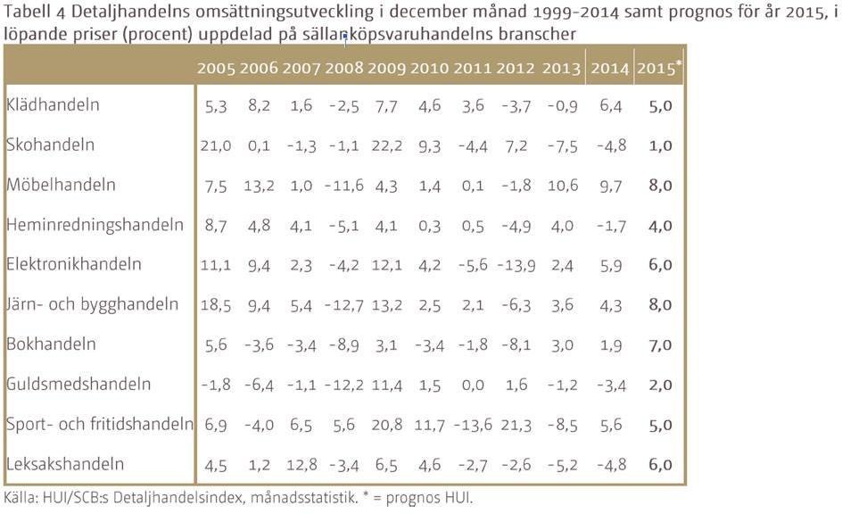

<!--
Kläder	| Skor	| Möbler | Heminredning | Elektronik | Järn/bygg | Böcker | Smycken | Sport | Leksaker
---- | ---- | ---- | ---- | ---- | ---- | ---- | ---- | ---- | ----
hej	 | hej	| hej | hej | Drönare | hej | hej | hej | hej | hej
hej	 | hej	| hej | hej | 3D-skrivare | hej | hej | hej | hej | hej
hej	 | hej	| hej | hej | Smart watch | hej | hej | hej | hej | hej
hej	 | hej	| hej | hej | Mini-actionkamera | hej | hej | hej | hej | hej
-->

På hittajulklappar.nu så har de lite andra kategorier (nedan). Det kan vara värt att försöka gruppera alla julklappar jag tar fram enligt båda dessa kategorisamlingar. Antingen tillsammans eller var för sig. Det kan exempelvis vara svårt att kategorisera 'Donation till gott ändamål'. Eller en elektronisk pryl som quadcopter vilken kan vara både en billig och dyr julklapp.

* Billiga julklappar
* Exklusiva julklappar
* Böcker & tidningar
* Köksprylar
* Personliga julklappar
* Retroprylar
* Roliga julklappar
* Smarta prylar
* Spel & pussel
* Teknikprylar
* Till hemmet
* Träning & hälsa
* Upplevelsepresenter

#### Item meta
Feature	| Värden 	| Beteckning
--------- | ------- | ----------
Namn 		| `{string}[NOMINAL]` | `iName` 
Pris 		| `{number}[REAL]` | `iPrice`
PrisGrupp | `{1,2,3,4,5n}[ORDINAL]` 	| `iPriceGroup`
Category	| `{stringlist}[NOMINAL]`	| `iCategory`
Is Sports?| `{0, 1}[BINARY]` | `isCatSports`
Is Electronics? | `{0, 1}[BINARY]` | `isCatElectronics` 
... | | 
Genus influence | `{Male, Female, Both}[NOMINAL]` | `genusType`
Is nerdy?	| `{0, 1}[BINARY]` | `isNerdy`
Is more for adolescents? | `{0, 1}[BINARY]` | `isChildItem`

Man hade eventuellt också behövt lagra en bild, vilket kan göras i BLOB-formatet. Efterforskning på hur man displayar en sådan bild kan eventuellt behöva göras. 

#### Notes på olika klappar

* De flesta klapparna som är populära i jul finns på coolstuff.se. Gjorde en rätt långdragen kartläggning av klappar som ledde mig till diverse hemsidor och retailers. Men 95% av alla dessa fanns ändå på coolstuff så antagligen kommer jag försöka hämta så mycket som möjligt från det här stället. Det öppnar också för att göra en scraper för att hämta all klappinfo. 
* Man kan fråga om de har djur och plocka någon kul djurpresent ( ex. [apport](https://hittajulklappar.nu/p/automatisk-apportkanon/))
* Media / Fotografering kan ju vara ett intresse. Mini-actionkameran är en, men digital polaroidkamera kanske är något (ex. [här](https://hittajulklappar.nu/p/kompakt-digital-polaroidkamera/)?
* Pysslig? 4D-pussel kan vara en hit (ex. [här](https://hittajulklappar.nu/p/4d-pussel-paris/)), eller 3D-varianten (ex. [här](https://hittajulklappar.nu/p/eiffeltornet-3d-pussel/)).
* Morgontrött? Väckarklocka som gör det lite svårare för en (ex. [här](https://hittajulklappar.nu/p/flygande-vackarklocka/)).
* Städfreak? Moppa med fötterna (ex. [här](https://hittajulklappar.nu/p/mopptofflor/)).
* Klantig i köket? Skärsäkra handskar (ex. [här]()https://hittajulklappar.nu/p/kokshandske-skarsaker/).
* Skäggmössa för barn. Solklar. (ex. [här](https://hittajulklappar.nu/p/skaggmossa-for-barn/)).
* Sällskapsspel? Schack för tre (ex. [här](https://hittajulklappar.nu/p/schack-tre/)).
* Ung och åt teknikhållet? Bygg-det-själv bergochdalbana (ex. [här](https://hittajulklappar.nu/p/spacerail-berg-och-dalbana-kula/)).
* Quadcopters! [här](http://www.hobbex.se/sv/artiklar/radiostyrt/multirotor/index.html?utm_source=adtraction&utm_medium=affiliate&utm_campaign=adtraction).

* ¡Fråga! Om man vill använda kategorier så kan man antingen göra det till en kolumn med nominella data (en lista med alla valbara kategorier och endast en kan väljas åt gången), eller så gör man lika många kolumner som kategorier och tvingar dessa till att vara binära och hur hur många som helst kan sättas till TRUE för en klapp. Då det är jag som sätter varje datarad tvivlar jag på att jag kommer sätta en TRUE på mer än tre kategorier per klapp. Hursomhelst, med detta kan man tillåta tvetydiga presenter att ha mer än en etikett på sig. 

### 2. Extern data
Det här rör demografiska data som kan ge ytterligare förklarande variabler. Exempelvis från postnummer. Kan det ge persona också så är det ju superbra. Vet att hitta.se har en livsstils app där de genom gatan kan få reda på medelinkomst, skuldsättning och vad folk på denna gata gillar i livet (vin, kultur, aktiehandel). 

~~Jag har ännu inte dykt ner i det här, men jag tänker hålla mig till att göra det enkelt. Den informationen jag får ut av SCB ska jag så klart försöka hämta så många potentiella variabler ifrån, men tänker inte lägga för mycket tid på det. Lyckas jag få ut snittinkomst och partitillhörighet så är jag rätt nöjd och hoppas det lyfter resultatet något.~~

Det jag har fått fram hittills är postnummer kopplat till kommunkod och kommunkod kopplat till diverse data -> Partival, Reala tillgångar, Kommundata. Se följande bilder för upplägg på CSV-filer. Jag kommer lägga till ett set med namnet på kommunerna och länen utifall att man vill använda det istället i modellen. Visserligen kommer jag troligen sätta upp en NN-modell vilket ändå inte kan tolkas, så namn på orter kan vara onödigt.

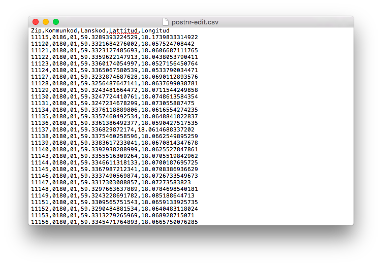
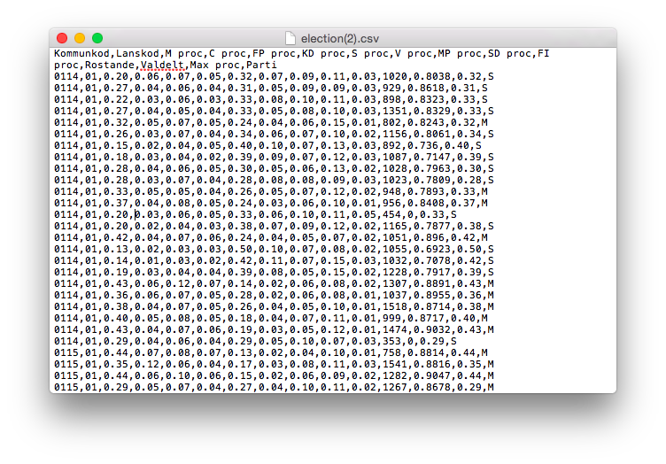
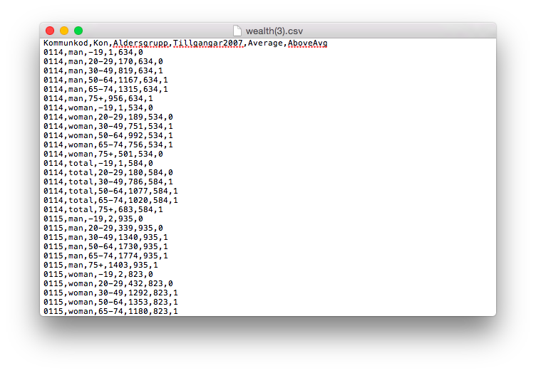
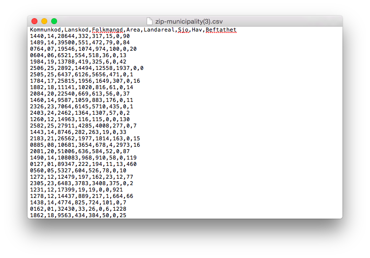 

<!--
#### 2.i Aktiviteter
* <input type="checkbox"> Ta fram dataset från lämplig datakälla (SCB?)
* <input type="checkbox"> Strukturera dataset och gör om eventuella features till lämplig datatyp. Inkomst -> Inkomstgrupp, till exempel.
* <input type="checkbox"> Deploya dataset som blob storage 
-->

### 3. Intern data
Detta gäller främst insamling från anställda på forefront med målet att få med de grundläggande **förklarande variablerna** och **svarsvariabeln**. 

* **Svarsvariabelns** utformning beror på om man har reinforcement learning som utgångspunkt eller ren retraining av modellen. Det förstnämnda innebär en plus/minus-poäng till predikteringen. Det sistnämnda innebär att feedback-svaret är det som predikteras. I det fallet kan man t.ex. prediktera binärt ("var det en bra gissning tycker du?") eller ordinalt ("hur bra var den här gissningen på en skala från 1-5?"). Då handlar det om att gissa en skala och välja det alternativ som ger maximal siffra på skalan. Dock är jag osäker på hur den här aspekten kan implementeras i Azure då den till synes inte kan göra om features till ordinala. Det är antingen categorical eller inte, och så kan man ställa in vilken datatyp (integer, float, string, etc). 
* För de **förklarande variablerna** hade det varit kul att göra lite roliga frågor oavsett om de är vettiga variabler i slutändan. Vissa kan ju visa sig ge entropi, tänk bayes. Nedan är några förslag. Kommer lägga mer tid på denna när jag väl bygger formuläret i hemsidan. Det kanske uppenbarar sig mer då. Men ska försöka mixa så mycket bland datatyperna som möjligt så att det blir lite roligare för användaren än bara exempelvis binära formulärfält. 

<!--
#### 3.i Aktiviteter

* <input type="checkbox"> Kom på vettiga och roliga frågor
* <input type="checkbox"> Bestäm frågornas datatyper
* <input type="checkbox"> Bestäm formulärelement
-->

#### 3.ii Förslag på grundläggande data (formuläret)
Prediktor		| Värden        | Beteckning
-------------	| ------------- | -------------
Kön				| `{0, 1}[NOMINAL::BINARY]`	| `sexType`
Ålder			| `{0-100}[DISCRETE]`	| `age`
				| `{1,2,3,4,5n}[ORDINAL/?/INTERVAL]` | `ageGroup`
Relation		| `{Spouse, Child, Parent, Sibling}[NOMINAL]` Kan bli knepig, man skriver ju in data för sig själv. Vi kan väl inte prediktera utifrån en extern relation då. | `relation`
Postnummer 	| `{?:/xxx xx/}[NOMINAL]` | `zipCode`
Senast reseland | Svårimplementerad. Kika på binära preferenser istället | `lastTravelDestination`
Föredrar sol / vintersemester	| `{0, 1}[NOMINAL::BINARY]` | `prefersSuntrip`
Föredrar mjuka / hårda klappar | `{0, 1}[NOMINAL::BINARY]` | `prefersSoftPresents`
Vilken choklad i Paradisasken | `{X, 0, 1, 2, ...}[NOMINAL]` | `chocolatePref`
Alt. Vit/Mörk/Mjölkchocklad? | `{Vit, Mörk, Mjölk, Inget}[NOMINAL]` | `chocolatePref`
Tror på tomten | `{Y, N, ?}[NOMINAL::BINARY]`| `santaBelief`
Hund eller katt? | `{0, 1, ?}[NOMINAL::BINARY]` | `prefersDog`
Intressen | Kan vara svår. Tänk om personen inte tycker om något av det jag föreslår. | `interests`
Brukar ha rim på julklappar? | `{}[BINARY]` | ``
Paradis eller Aladin? | `{}[NOMINAL:BINARY]` | ``
Köttbullar
Prinskorvar
Skinka
Sill
Brysselkål,
Röd/Brunkål
Lutfisk
Ägg
Lax
Janssons
Sylta

Knäck
MArsipan
Nougat
Pepparkaka
Lussebulle
Ischoklad
Polkagris

## SQL relaterad info

Jag har precis fått tillgång till lösenord för en av våra azure-servrar (f5bv9w5661). Användarnamn och lösen fås av mig om eller Johnny. Den databas jag använder heter ffcgamd-db (se [här](https://manage.windowsazure.com/ffcg.se#Workspaces/SqlAzureExtension/SqlServer/f5bv9w5661/Database/5.f5bv9w5661/QuickStart)). Hittills har jag lagt upp en table för användaruppgifter (userInput). Jag kommer nog fortsätta med tre tabeller, alltså en för dessa användaruppgifter, en för klappinfo och en för användar-klapp-ratings. Eventuellt kommer även en databas finnas för externa data så att man från hemsidan kan hämta vissa externa uppgifter utifrån det användaren matat in (ex. postnummer -> inkomst). 

De connection strings som jag kommer använda kommer främst vara ODBC och PHP. ODBC för att hämta data till azuremodellen och PHP för att lagra från hemsidan. 

```
// ODBC
Driver={SQL Server Native Client 10.0};Server=tcp:f5bv9w5661.database.windows.net,1433;Database=ffcgamd-db;Uid=ffcgdb_web@f5bv9w5661;Pwd={your_password_here};Encrypt=yes;Connection Timeout=30;

// PHP
Server: f5bv9w5661.database.windows.net,1433 \r\nSQL Database: ffcgamd-db\r\nUser Name: ffcgdb_web\r\n\r\nPHP Data Objects(PDO) Sample Code:\r\n\r\ntry {\r\n   $conn = new PDO ( \"sqlsrv:server = tcp:f5bv9w5661.database.windows.net,1433; Database = ffcgamd-db\", \"ffcgdb_web\", \"{your_password_here}\");\r\n    $conn->setAttribute( PDO::ATTR_ERRMODE, PDO::ERRMODE_EXCEPTION );\r\n}\r\ncatch ( PDOException $e ) {\r\n   print( \"Error connecting to SQL Server.\" );\r\n   die(print_r($e));\r\n}\r\n\rSQL Server Extension Sample Code:\r\n\r\n$connectionInfo = array(\"UID\" => \"ffcgdb_web@f5bv9w5661\", \"pwd\" => \"{your_password_here}\", \"Database\" => \"ffcgamd-db\", \"LoginTimeout\" => 30, \"Encrypt\" => 1);\r\n$serverName = \"tcp:f5bv9w5661.database.windows.net,1433\";\r\n$conn = sqlsrv_connect($serverName, $connectionInfo);
```

### Notes
* ~~Alla presenter som ska föreslås, det är ju också ett arbete att ta fram! Kolla årets julklappar någonstans? Göra en lista på vanliga butiker som folk köper klappar på eller kika på enstaka artiklar som varit populära på sistone. Har amazon sån data?~~ Lista påbörjad med diverse länkar. Mestadels kommer dock från Coolstuff i dagsläget pga enkelheten och att de täcker det mesta som alla andra bara täcker in delvis. 
* Jag kan samla in all interna data från Forefront. Klurigt hur det kan gå till med feedback-loopen. Man kan tänka sig att alla matar in information om flera klappar, om inte alla! Det kunde vara t.ex. en sorts godkännande/bortkastande eller rangordning av klappar. Visar man många tänker jag att det förstnämnda är lättare. Visar man det sistnämnda så är det nog bättre med färre. Det förstnämnda innebär dock problem i hur du konstruerar responsvariabeln och val av ML approach. ==Se diskussioner nedan kring konstruktion av detta med insikt kring hur olika Azure-modeller fungerar.==
* ~~Om man skulle ge en del alternativ för folk som samlar in data, vad påverkar det att man inte ger alla alternativen? Vi kanske har 50 klappar på lager men vi vill bara att en person ska på sin höjd få tre förslag som den ska ta ställning till om den tycker det är vettiga förslag eller ej. Då kan man ju inte köra one-vs-all för personen har inte tagit ställning till alla andra alternativ när den bestämmer sig för just en.~~

## <a name="azure"></a>Azure

<!--
### Aktiviteter

* <input type="checkbox" checked> Bestämma approach
* <input type="checkbox" checked> Bygga testdataset för test av genomförbarhet. Speciellt fokus på svarsvariabeln.
* <input type="checkbox" checked> Bygg modell
* <input type="checkbox"> Bygg struktur för input och koppla i Azure (beror på backend approach).
* <input type="checkbox"> Deploy web service och hooka på i hemsidan.
-->

### Alternativ
Jag har lämnat approachen med att använda mig av ett matchbox recommender system. Se nedan för mer info kring det. Har även lämnat classification-området och använder mig nu av regression models. 

Jag är osäker på hur upplägget av kombinationen mellan data från användaren och klapparna ska se ut. Man kan t.ex. välja att rate'a alla klappar från 1-10 eller {0,1} (binärt). Hur ska då en inlärningsmodell ta fram en klapp när alla träningsdata består av en massa rader med användarfeatures från en användare, features från en klapp och den ratingen just den klappen fick? Jag vill ju prediktera något som inte är i datasetet i det fallet. 

User age | User wealth | User hobby | Item price | Item category | User-item-rating
------- | ------- | ------- | ------- | ------- | -------
20år | 400000kr | Fotboll | 100kr | Elektronik | `rating: 6` <br> eller `isApproved: TRUE`
20år | 400000kr | Fotboll | 200kr | Sport | `rating: 4` <br> eller `isApproved: FALSE`

### a) Regression models
Predikterar man rating så är det en regressionsmodell jag är ute efter. Jag byggde ett dataset på sättet ovan där varje användare utgör flera rader om de rateat flera items. Här är då rating det jag vill prediktera och använder både user features och item features på detta sättet. Det är det närmaste en matchbox recommender jag kan komma. 

<hr>
Jag provbyggde en Azure-modell som provar alla stora regressionsmodeller mot varandra. Den här modellen kan jag använda sen när jag ska tweaka mot den riktiga datan så den kommer ligga som den gör tills det är dags. 

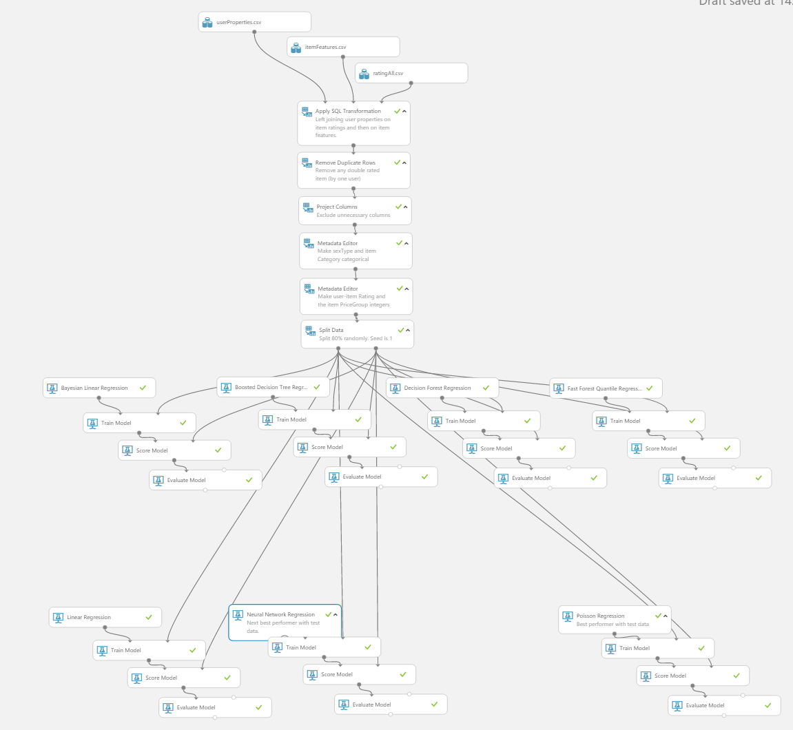
Den här visar modellen i sin helhet. Den finns på [denna länk.](https://goo.gl/rvDfyp)

.png)
Den här visar första delen av modellen som joinar test-datan (userfeatures, itemfeatures och user-item-ratings) samt tvättar den. 

.png)
Den här visar en del av modellen där själva träningsmodellerna är uppradade. I dagsläget har jag inget bra sätt att koppla ihop deras resultat för att visualisera vilken som presterar bäst. Fungerade bra med classifiers men något annat krävs för regressionsmodeller då de spottar ibland ut olika form på deras data. 

<hr>
Jag deployade training-modellen med endast en neural-net regression model och försökte få den att prediktera alla items för en enda användare. För att göra det så fick jag kringå det vanliga upplägget och försöka force-joina användar-datasetet med item-datasetet. Input-modulen följer endast formatet på det element som den delar input-point med. I det här fallet är det användar-datasetet. Med lite rensning av denna kunde jag se till att den deployade modellen endast kräver användarfeatures som input. 

I figuren nedan är en överblick på modellen med beskrivningar. Modellen kan nås genom den [här länken.](https://goo.gl/FyA7xd)

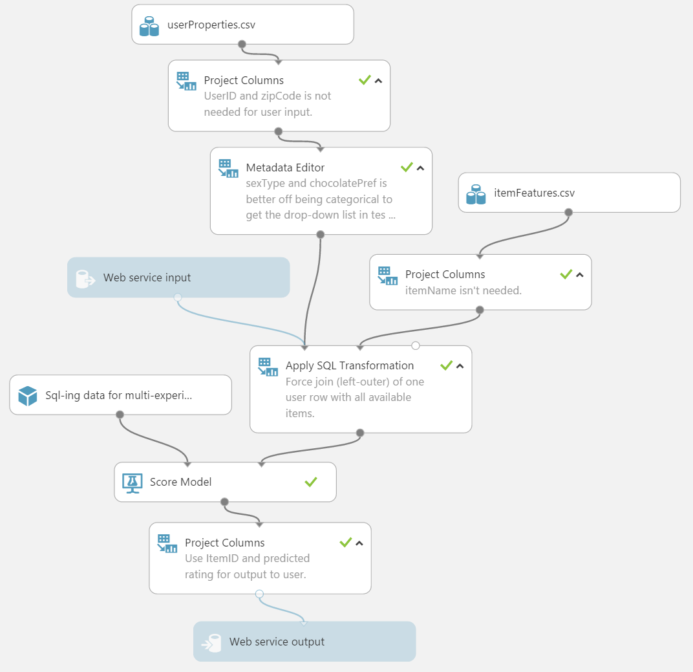

Formatet på output-datan är med det här upplägget rätt så praktiskt. Man får tillbaka en JSON-sträng där den predikterade ratingen för varje item finns uppradad. Man kan själv sedan sortera det här i en vektor och välja den högsta eller kanske de tre högsta att presentera för användaren. 

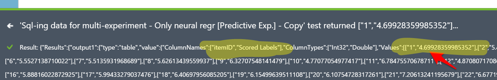

#### Web service credentials
För att komma åt informationen kopplat till den hittills deployade modellen går man till [följande länk.](https://goo.gl/JUQhAZ)

* Där finns allra viktigast [requestAPIn](https://goo.gl/85hoYw)
* Men även API-nyckeln


### b) Classifiers
<!--<span style="display:block;background:pink;width:13em;padding:4pt" onclick="hide('classifiers')">Klicka för att se mer \/</span>-->

#### 1. Multiclass classifier
*Inte aktuellt längre.*

<!--
* Multiclass classification med
	* Multiclass decision forest
	* Multiclass logistic regression
	* Multiclass decision jungle, också nytt för mig här.
-->

#### 2. One-vs-all w. two-class classifier
*Inte aktuellt längre.*

<!--
* Two-class decision forest
* Two-class boosted decision tree
* Two-class Bayes point machine
* Two-class logistic regression	
* Two-class averaged perceptron
* Eventuellt också Two-class decision jungle, inte prövat tidigare. 
-->

#### 3. Neural net classifier
*Inte aktuellt längre*

<!--
Osäker på hur det hade gått till med hela retraining-biten. Jag är van vid att neurala nätverk tar lång tid att träna, så där måste man nog fokusera på reinforcement learning vilket är lite utanför min kunskapsdomän.

MEN! Ska man bara retraina en gång om dagen så kan ett neuralt nät fungera hur bra som helst. Dock osäker på upplägget av kombinationen mellan användarfeatures -> klappfeatures -> och svarsvariabel av användaren om varje klapp.
-->

#### 4. Hybrid matchbox recommender
*Inte aktuellt längre*

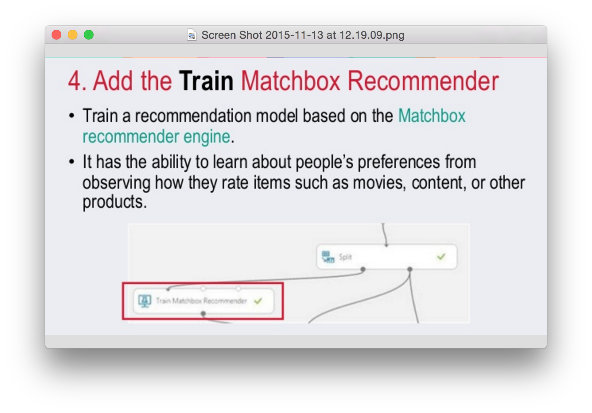

<!--
Använder man Azure Matchbox recommender så ska man veta vilka två typer det finns att utgå ifrån när det kommer till recommenders:

* Content-based approach
	* <span style="font-size:0.8em">makes use of features for both users and items. Users may be described by properties such as age and gender, and items may be described by properties such as author and manufacturer. Typical examples of content-based recommendation systems can be found on social matchmaking sites.
* Collaborative filtering	
	* <span style="font-size:0.8em">uses only identifiers of the users and the items and obtains implicit information about these entities from a (sparse) matrix of ratings given by the users to the items. We can learn about a user from the items they have rated and from other users who have rated the same items.
* *The Matchbox recommender combines collaborative filtering with a content-based approach. It is therefore considered a hybrid recommender. When a user is relatively new to the system, predictions are improved by making use of the feature information about the user, thus addressing the well-known "cold-start" problem. However, once there are a sufficient number of ratings from a particular user, it is possible to make fully personalized predictions for them based on their specific ratings rather than on their features alone. Hence, there is a smooth transition from content-based recommendations to recommendations based on collaborative filtering. Even if user or item features are not available, Matchbox will still work in its collaborative filtering mode.*
* En recommender kräver ett smart upplägg på inparametrarna. Se [den här](https://msdn.microsoft.com/library/azure/55544522-9a10-44bd-884f-9a91a9cec2cd?f=255&MSPPError=-2147217396#ItemRecommendationOptions) beskrivningen för mer info. 
-->

## <a name="feedbackloop"></a>Feedback loop
Hittills har mestadels av alla google-länkar lett mig till reinforcement learning (RL). Eftersom det känns som ett annat sorts problem (mer robotar och likheter mot reglerteknik), så har jag satt stopp för just den här grenen. Det jag i annat fall är ute efter är en modell som återtränas, t.ex. vissa klockslag under dagen eller efter ett visst antal svarsinlägg, detta relaterar till programmatic retraining av ens modell. 

Mitt nästa steg är att få till retraining manuellt genom att man lägger till endpoints till ens modell i ML Studio. Sedan får jag dyka ner i retrainingen igen när jag kommit en bit in i byggandet av hemsidan. Detta då det helst ska ske med ett C#-script och om jag ska lära mig det allteftersom hemsidan byggs så kan jag slänga på den dimensionen sist. 

<!--
### Aktiviteter

* <input type="checkbox"> Välj approach till feedback loop
* <input type="checkbox"> Implementera lösning (ev. lite kodning jag inte är van vid)
-->

### Relevanta begrepp
* RL (reinforcement learning).
* Online learning (tips på automatiserad inlärning)
* Programmatic retraining

### Programmatic retraining
Retraining har Azure [ett exempel](https://azure.microsoft.com/sv-se/documentation/articles/machine-learning-retrain-models-programmatically/) på hur man kan implementera för att *Retrain ML models programatically*. 

När man publishat sin modell (tränat) så kan man gå tillbaka till Training Experiment och lägga till en output module efter Train Model. Dock verkar det som att Microsofts dokumentation av Azure är för gammal för de har ändrat beteckningar på saker och ting. Kör Retraining web service, det borde ge samma resultat.
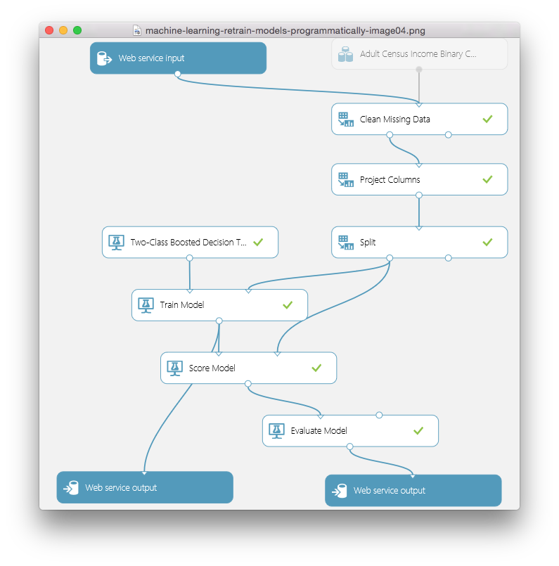

### Azure layout
Approachen kring retraining har jag satt till följande koncept.
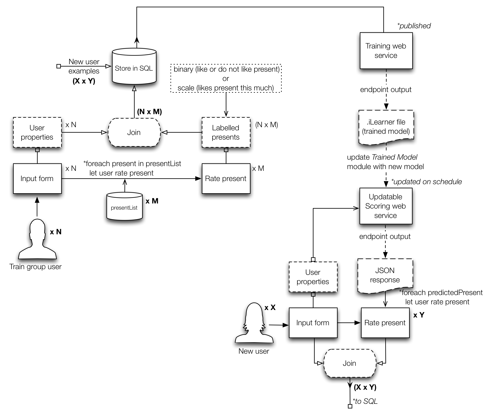

Hittills har jag lagt upp ett testexempel som använder sig av två C# console applications. Förfarandet gick till så här: 

1. Träna modell på testdata (3 sparade dataset, kommer i framtiden vara SQL-databasen som inmatade data blir sparade i). 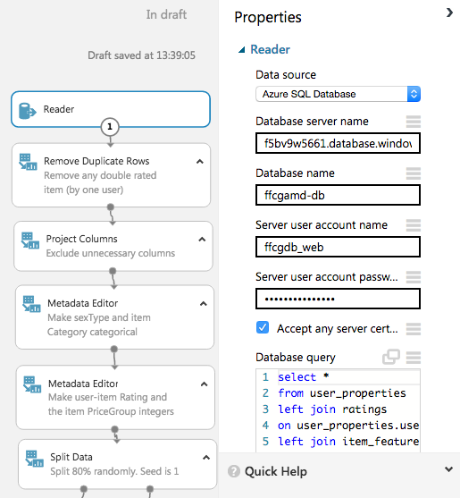
2. Gör ett predictive experiment med denna träningsmodell och deploya pred.experimentet som web service.
	* Jag lade till en endpoint till denna predictive web service som ska användas för att updatera den tränade modellen som den använder för prediktion.
	* Som sagt kommer inmatningskällor ändras till SQL-databas samt få web service input justerat så att användarna bara behöver mata in deras uppgifter och ge item ratings.
3. Tillbaka till träningsmodellen lade jag till två web service outputs. Inte tre (alltså en input därtill) som i retrainingsexemplen som finns där ute. Jag vill träna på en och samma datakälla varje gång och det ska vara SQL-databasen. Denna modell kördes och sen deployades som web service.
4. Nu har jag två web services. En [train][predictive exp.] och en [train] (nomenklatur på detta vis för att visa att prediktionsexemplet är "länkat" till den modell som är [train]). 
	* Den första är riktad till användarna och den sista är den som ska spotta ut tränade modeller (format: .iLearner)
5. Med ena konsolapplikationen kör jag en BES (batch execution service) på [train]-webservicen (se [här](https://europewest.studio.azureml.net/Home/ViewWorkspace/0c8371e1485946f48a61b4bdd4f07c2c?#Workspaces/WebServiceGroups/WebServiceGroup/257abfa4919e4282a4953cfff2d1a6d3/dashboard)). Detta spottar ut en .iLearner och en .csv som visar evalueringsresultaten. Det lagras i en blob storage på Azure (konto: analyticsanta, mapp: test/).
6. Med den andra konsolapplikationen gör jag en Update Resource med en PATCH på URI:n som hittas på den endpoint som heter ***Retrain*** för [train][predictive exp.]-webservicen (se [här](https://manage.windowsazure.com/ffcg.se#Workspaces/MachineLearningExtension/Workspace/analytic-santa/WebService/9f25b7cfe2cb46f19fa50ff60b85df73/Endpoint/retrain/Dashboard)). Detta ersätter den tränade modell som prediktionsmodellen använder. 
	* I framtiden kan man försöka kolla ifall evalueringsresultaten är bättre än den nuvarande modellens resultat. .csv-filen ligger kvar i blob-storageutrymmet så man hade kunnat hämta och parsea den för jämförelse och beslut om ersättning av modell. 
7. Tanken är att användaren matar in sina uppgifter och sen får ta ställning till en klapp i taget. Testanvändarna får ta ställning till alla klappar. De riktiga användarna får predikterat några klappar på sina uppgifter varpå deras rating av dessa klappar blir sparade i huvuddatabasen tillsammans med deras uppgifter.
8. När man vill återträna modellen är det i dagsläget bara att köra de två scripten. I framtiden vill jag ha det integrerat i hemsidan så att återträningen kan köras precis hur ofta man vill. I praktiken kan man be om en återträning efter varje persons submit eftersom bytet av modell sker utan att man vet om det som användare. Helst skulle det då endast bytas om modellen är bättre en den nuvarande, vilket hade sparat kraft. 

### Notes
* ~~Problemet är att du på Azure till synes inte kan återträna modellen direkt. Och det verkar heller inte vara ett reinforcement learning problem, utan mer att varje ny person som svarar ger en till datarad.~~ Man kan återträna modellen direkt eller nästan direkt. 
	* Eventuellt hade man kunnat lägga upp två modeller där ena är igång när den andra tränas.
	* Det kan vara så att det går jättebra att träna modellen direkt efter ett svar kommit in och att det fungerar medan folk använder hemsidan. Man kan göra en avvägning när man ska byta ut endpointen -> Är den nya modellen bättre? Ja -> Är det någon som använder modellen nu? Ja -> Kolla igen om x minuter. 
* Feedback loopen hänger lite på vad man vill prediktera. T.ex. vill man prediktera om det är antingen en bra eller dålig julklapp att ge så är det binär feedback man vill få, alltså vad man själv tror om klappens hållbarhet framför granen. Vill man prediktera något i stil med likelyhood eller hur bra en present är så är det mer en skala man förhåller sig till och därav kanske frågar om vad man tror hållbarheten är på en skala mellan 1-10. 
* ~~Ska man kanske ska få en del alternativ och ge feedback på alla dessa? Det snabbar ju upp processen. Om det är genomförbart kanske man kan ge feedback på alla utifrån den persona som är aktuell. Dock kan det bli för tidsödande.~~ Alla som hjälper till med datainsamling måste ta ställning till alla presenter. När man kör lösningen kanske man bara får en del eller en present.
* ~~Ev. efterforskning på annan lösning. Där har t.ex. deployment av hemsida med R genom [OpenCPU](https://www.opencpu.org/apps.html) varit ett alternativ. Dock kan det ta ifrån den enkelheten som det innebär att arbeta med Azure i grunden. Men eftersom man kan arbeta med R mer direkt på hemsidan så kan man eventuellt implementera feedback-loopen lättare (aka mer som man vill).~~ Satsar på OpenCPU i senare projekt.

## <a name="hemsidan"></a>Hemsidan

### Front-end

<!--
#### Aktiviteter

* <input type="checkbox"> Välj tema
* <input type="checkbox"> Bestäm vy-upplägg med syfte på varje vy
* <input type="checkbox"> Ta fram koncept på formulärelement
* <input type="checkbox"> Ta fram koncept på vyerna
* <input type="checkbox"> Implementera reaktiva element (AngularJS / jQuery)
* <input type="checkbox"> Implementera HTML/CSS
-->

#### Color palette

• F5624D • CC231E • 34A65F • 0F8A5F • 235E6F

#### Start view
Den här vyn baseras dels på att du vet vilket steg du befinner dig i, men även en horisontell accordion. Hade dock kunnat vara kul att göra om det här konceptet till din resultat-vy. Idén går ut på att klapparna gömmer sig bakom varje fält och när man trycker på en så åker fältet fram som accordion och klappen exponeras. Väl där får man rate:a klappen eller vad som nu bestäms. 
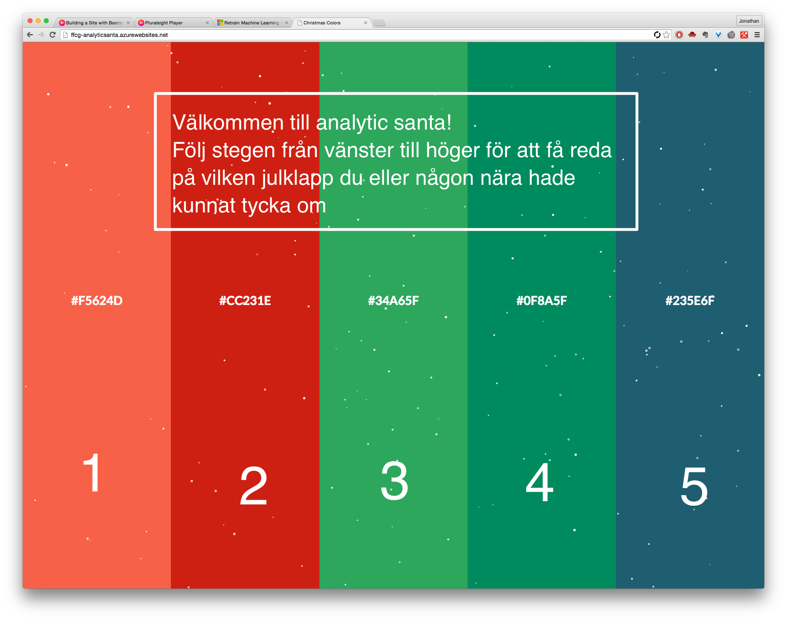

#### User properties view
Användaren kan börja med att mata in det som blir rena demografiska variabler. Nästa steg kan bli mer frågor som är roliga. 

#### Question view
Konceptuellt handlar det om att ha någon progress bar och lite fält med användarvänliga formulär-element. I det här fallet är det bara boxar för ja/nej. Lämpligt är att rita upp formulärstrukturen för sig själv. 
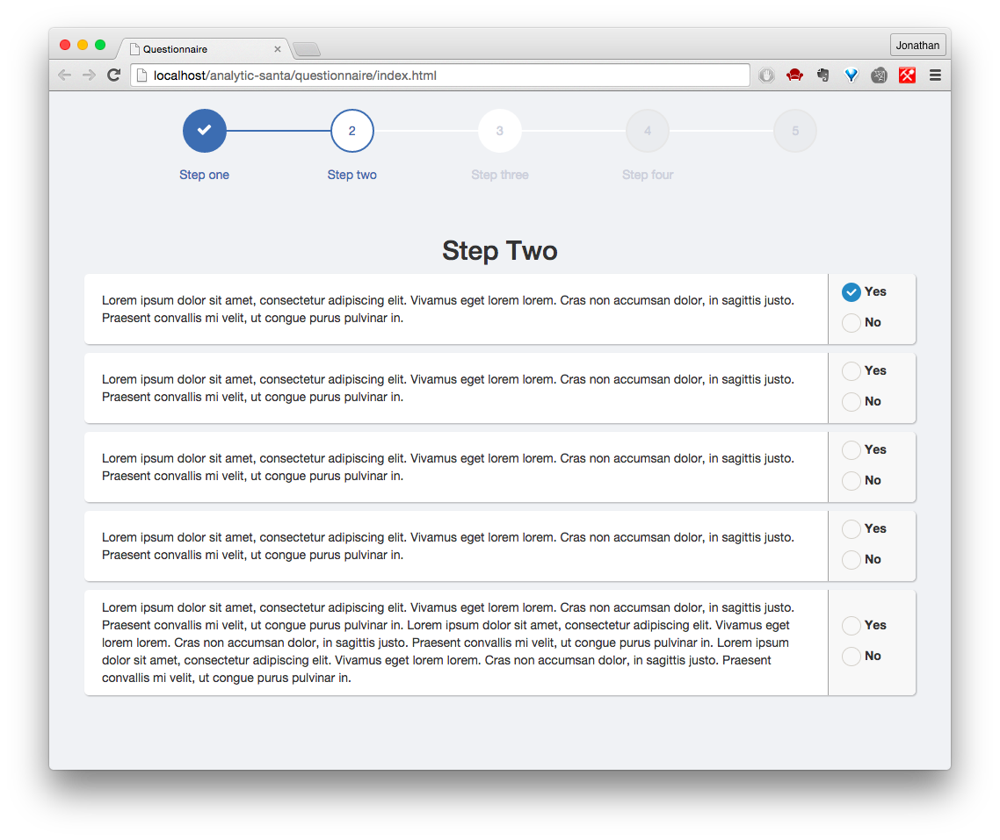

#### Results view
Den här vyn hänger mycket på hur man vill konstruera svarsvariabeln. Detta då det här steget behöver vara dels genomförbart och kul att göra, samt ge data som faktiskt hjälper en att prediktera presenter. 

### Back-end

<!--
#### Aktiviteter

* <input type="checkbox"> Bestäm lagringsmetod för input-data (går mot retraining-biten)
* <input type="checkbox"> Välj metod (php/Node.js) och implementera script för lagring av input-data.
* <input type="checkbox"> Sätt ihop kommunikation mellan vyer.
* <input type="checkbox"> Sätt upp kommunikation mot Azure
* <input type="checkbox"> Implementera kodlösningen för automatisk programmatisk retraining genom hemsidan.
-->

## Länkar osv.
* [Slideshare:: Azure](http://www.slideshare.net/WorapotJakkhupan/308471-ch5-machine-learning-using-microsoft-azure/20)
* [Azure cheet sheat](https://azure.microsoft.com/sv-se/documentation/articles/machine-learning-algorithm-choice/)
* [Retrain programatically](https://azure.microsoft.com/sv-se/documentation/articles/machine-learning-retrain-models-programmatically/)
* Sökord:: Årets julklapp
* [Must-have toys | Amazon](http://www.madeformums.com/news-and-gossip/must-have-toys-for-christmas-from-the-biggest-sellers/30958.html)
* [Data types](https://en.wikivet.net/Data_types)
* [Score matchbox recommender](https://msdn.microsoft.com/library/azure/55544522-9a10-44bd-884f-9a91a9cec2cd?f=255&MSPPError=-2147217396#ItemRecommendationOptions)
* [Gåvor för p/f/m/k](https://www.thegreatgiftcompany.co.uk/occasions/special_occasions/christmas)
* [Exempel på retraining - lite äldre](https://azure.microsoft.com/sv-se/blog/retraining-and-updating-azure-machine-learning-models-with-azure-data-factory/)
* [Julklappstipsen.nu!!](http://www.julklappstipsen.nu/)
* [Hur recommender data splittas](https://msdn.microsoft.com/library/azure/70530644-c97a-4ab6-85f7-88bf30a8be5f#algorithm)
* [Hur recommender scorer används](https://msdn.microsoft.com/library/azure/55544522-9a10-44bd-884f-9a91a9cec2cd#ItemRecommendationOptions)
* [Hur train recommender används](https://msdn.microsoft.com/library/azure/fa4aa69d-2f1c-4ba4-ad5f-90ea3a515b4c)
* [Tips på recommenders i Cortana gallery](http://gallery.cortanaanalytics.com/browse?s=recommender)
* [Movie recommender | Med beskrivning](http://gallery.cortanaanalytics.com/Experiment/Recommender-Movie-recommendation-3)
* [Restaurant recommender | Med beskrivning](http://gallery.cortanaanalytics.com/Experiment/Recommender-Restaurant-ratings-2)
* [Eventuell, men i övrigt dålig hjälp på problem med recommender](https://social.msdn.microsoft.com/Forums/azure/en-US/90a8c645-ac75-490b-b1d7-ec9b40f226f9/matchbox-recommendation-with-no-userid-and-with-single-result?forum=MachineLearning)
* [Recommender split data tips](http://research.microsoft.com/en-us/um/cambridge/projects/infernet/docs/Learners%20-%20Matchbox%20-%20API%20-%20Mappings%20-%20Splitting.aspx)
* [Lite info kring recommenders och vad det kan ge (scrolla ner)](https://azure.microsoft.com/sv-se/documentation/articles/machine-learning-interpret-model-results/)